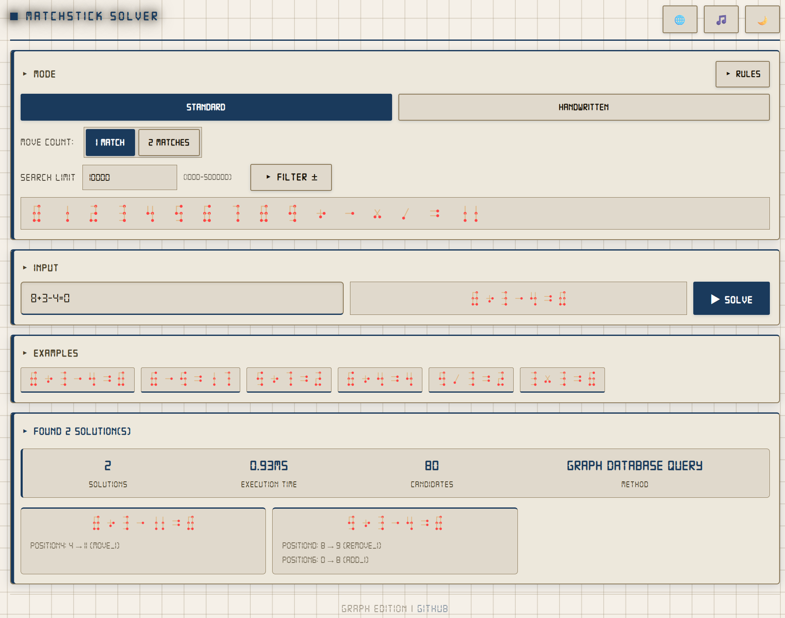

# Matchstick Equation Solver - Graph Edition 

[ 中文](./README.md) | [ English](#)

**Version: v0.3**

---

A high-performance matchstick equation solver powered by **graph databases**  the next generation of [matchstick-puzzle-solver](https://github.com/8188/matchstick-puzzle-solver). Character transformation rules are modeled as a graph, with Cypher queries replacing brute-force enumeration for better efficiency and scalability.

**Now supports dual database options:**
- **FalkorDB**: Lightweight Redis-based graph database
- **AuraDB**: Neo4j cloud-native graph database

## Features

-  🗄️  **Dual Database Support**: Flexible choice between FalkorDB or AuraDB (Neo4j) as graph storage engine
-  🔀  **Dual Modes**: Standard seven-segment mode + handwritten mode (`(n)H` syntax)
-  ✏️  **Custom Rules**: Online rule editing with persistence to the graph
-  ↔️  **Move Selection**: Supports solving with 1 or 2 matchstick moves
-  🎨  **SVG Live Preview**: Real-time matchstick equation rendering as you type
-  ⚙️  **Advanced Syntax**: Supports `=+`, `=-`, leading sign expressions

## Quick Start

### Prerequisites

- Node.js 18+
- One of the following databases:
  - **FalkorDB** (recommended for local development)
  - **AuraDB** (Neo4j cloud service)

### Database Selection

#### Option 1: Using FalkorDB (Local)

```bash
# Start FalkorDB
docker run -p 6379:6379 -it --rm falkordb/falkordb:latest
```

#### Option 2: Using AuraDB (Cloud)

1. Visit [Neo4j AuraDB](https://neo4j.com/product/aura/) to create a free instance
2. Obtain connection credentials (URI, username, password)

### Install & Configure

```bash
git clone <repo-url>
cd matchstick-solver-graph

# Install dependencies
npm install

# Configure database
cp .env.example .env
# Edit .env file, select database type and fill in connection details
```

### Initialize & Run

```bash
# Initialize graph data (first time or after rule updates)
npm run init-graph

# Start backend server (default port 8080)
npm run dev

# Frontend: open frontend/index.html directly, or serve statically
npx http-server frontend -p 3000
```

Then visit: `http://localhost:3000/index.html`

## Project Structure

```
matchstick-solver-graph/
 backend/
    src/
        database/                 # Database adapter layer
           IGraphDatabase.ts      # Unified interface
           FalkorDBAdapter.ts     # FalkorDB implementation
           AuraDBAdapter.ts       # AuraDB implementation
        config.ts                 # Configuration management (.env support)
        solver.ts                 # Core solver
        index.ts                  # Express API server
        graph-builder.ts          # Graph initialization
        parse-rules.ts            # Rule parsing utility
 frontend/
    index.html                    # Main page
    rules.html                    # Rules viewer page
    js/
       app.js                     # Main app controller
       i18n.js                    # Internationalization
    styles/
        main.css                  # Global styles
        components.css            # Component styles
        animations.css            # Animations
 test/
    test-solver.ts                # Integration tests
    check-graph.ts                # Graph data validation
 .env.example                     # Environment variable template
 package.json
```

## API Reference

| Method | Path | Description |
|--------|------|-------------|
| `POST` | `/api/solve` | Solve equation |
| `GET` | `/api/rules/:mode` | Get transformation rules |
| `POST` | `/api/cache/clear` | Clear server-side cache |
| `GET` | `/api/cache/stats` | View cache statistics |

**Solve request example:**

```json
POST /api/solve
{
  "equation": "8+3-4=0",
  "mode": "standard",
  "moveCount": 1,
  "maxSolutions": 100
}
```

## Testing

>  Tests require the backend service and FalkorDB running simultaneously

```bash
npm test

# Test with cache cleared (measures real query speed)
npm test -- --no-cache
```

## Comparison with matchstick-puzzle-solver

| Feature | matchstick-puzzle-solver | matchstick-solver-graph |
|---------|--------------------------|-------------------------|
| Architecture | Pure frontend, in-memory rules | Frontend/backend separated, graph DB |
| Database | None | FalkorDB / AuraDB selectable |
| Rule Storage | JS objects | Graph nodes/edges |
| Query Method | Brute-force + pruning | Cypher graph queries |
| Scalability | Limited | High (dynamic rule addition) |
| Configuration | Hardcoded | .env environment variables |
| Deploy Complexity | Very low (static page) | Medium (requires database) |
| Testing | Pure frontend node script | HTTP API integration tests |

### Performance Notes

**FalkorDB** offers the best performance, with true concurrent query support and minimal latency, making it the ideal choice for local development and testing.

**AuraDB** provides identical functionality but is significantly slower than FalkorDB due to Neo4j's session management constraints and network latency. However, AuraDB is still many times faster than the original matchstick-puzzle-solver version, with the advantage of scalability and cloud deployment convenience.

##  TODO List

- [ ] **Puzzle Generator**: Automatically generate matchstick puzzles of varying difficulty
- [ ] **Hint System**: Provide step-by-step hints
- [ ] **Difficulty Ratings**: Auto-evaluate difficulty based on moves and solution count
- [ ] **Share Function**: Generate puzzle links for sharing
- [ ] **Add test cases**: Expand integration and edge-case coverage
- [ ] **Explore new gameplay**: New puzzle variants and rule-sets
- [ ] **Polish UI**: Improve visuals and responsiveness
- [ ] **Consider an App version**: Mobile/desktop packaged release

## Changelog

See changelog: [doc/CHANGELOG.en.md](doc/CHANGELOG.en.md)

## Screenshots



## License

MIT License

## Acknowledgments

- Graph database support:
  - [FalkorDB](https://github.com/FalkorDB/FalkorDB) - Redis-based graph database
  - [Neo4j AuraDB](https://neo4j.com/product/auradb/) - Cloud-native graph database

---
