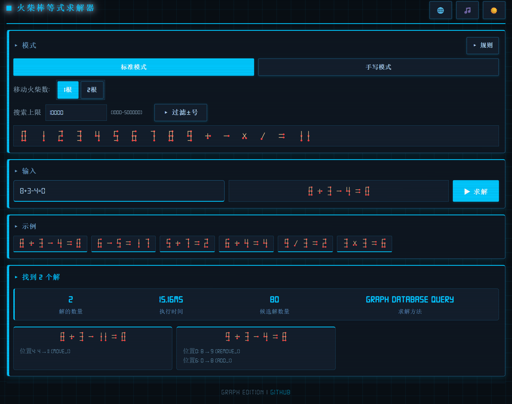

# 火柴棒等式求解器 Graph 版 

[ 中文](#) | [ English](./README.en.md)

**Version: v0.3**

---

基于**图数据库**的高性能火柴棒等式求解实现——一个与 [matchstick-puzzle-solver](https://github.com/8188/matchstick-puzzle-solver) 并列的图数据库版本。将字符变换规则建模为图，通过 Cypher 查询与服务端缓存来加速变换查找并提升可扩展性。

**现已支持三种数据库选择：**
- **FalkorDB**：轻量级 Redis 图数据库
- **AuraDB**：Neo4j 云原生图数据库
- **RealmDB**：本地对象数据库（适合小规模数据）

## 特性

-  🗄️  **三数据库支持**：灵活选择 FalkorDB、AuraDB（Neo4j）或 RealmDB 作为存储引擎
-  🔀  **双模式支持**：标准七段码模式 + 手写模式（`(n)H` 语法）
-  ✏️  **自定义规则**：支持在线编辑并写回图数据库
-  🔧  **移动选择**：支持移动 1 根或 2 根火柴
-  🎨  **SVG 实时渲染**：输入即显示火柴棒等式预览
-  ⚙️  **高级语法**：支持 `=+`、`=-`、前导正负号等表达式

## 快速开始

### 前置依赖

- Node.js 18+
- 以下数据库之一：
  - **FalkorDB**（推荐本地开发）
  - **AuraDB**（Neo4j 云服务）
  - **RealmDB**（本地对象数据库，无需额外安装）

### 数据库选择

#### 选项 1: 使用 FalkorDB（本地）

```bash
# 启动 FalkorDB
docker run -p 6379:6379 -it --rm falkordb/falkordb:latest
```

#### 选项 2: 使用 AuraDB（云端）

1. 访问 [Neo4j AuraDB](https://neo4j.com/product/aura/) 创建免费实例
2. 获取连接信息（URI、用户名、密码）

#### 选项 3: 使用 RealmDB（本地）

RealmDB 是一个本地对象数据库，无需额外安装或配置。适合：
- 快速开发和测试
- 小规模数据集
- 不想安装额外数据库服务

**注意**：RealmDB 不是原生图数据库，性能可能不如 FalkorDB/AuraDB，但对于学习和小规模使用已足够。

### 安装与配置

```bash
git clone <repo-url>
cd matchstick-solver-graph

# 安装依赖
npm install

# 配置数据库
cp .env.example .env
# 编辑 .env 文件，选择数据库类型并填写连接信息
```

### 初始化与运行

```bash
# 初始化图数据（仅首次或规则更新后）
npm run init-graph

# 启动后端服务（默认端口 8080）
npm run dev

# 前端：直接用浏览器打开 frontend/index.html，或启动静态服务
npx http-server frontend -p 3000
```

然后访问：`http://localhost:3000/index.html`

## 项目结构（高层）

```
matchstick-solver-graph/
├─ backend/       # API 服务、图数据库适配器、求解器实现
├─ frontend/      # 静态前端（index.html、资源、脚本）
├─ test/          # 集成与校验测试
├─ .env.example   # 环境变量模板
└─ package.json
```

## API 文档

| 方法 | 路径 | 说明 |
|------|------|------|
| `POST` | `/api/solve` | 求解等式 |
| `GET` | `/api/rules/:mode` | 获取变换规则 |
| `POST` | `/api/cache/clear` | 清除服务端缓存 |
| `GET` | `/api/cache/stats` | 查看缓存统计 |

**求解请求示例：**

```json
POST /api/solve
{
  "equation": "8+3-4=0",
  "mode": "standard",
  "moveCount": 1,
  "maxSolutions": 100
}
```

## 测试

>  测试需要后端服务和 FalkorDB 同时运行

```bash
npm test

# 清除缓存后测试真实查询速度
npm test -- --no-cache
```

## 与 matchstick-puzzle-solver 的对比

| 特性 | matchstick-puzzle-solver | matchstick-solver-graph |
|------|--------------------------|-------------------------|
| 架构 | 纯前端 | 前后端分离，图数据库驱动 |
| 数据库 | 无（规则内存/本地缓存） | FalkorDB / AuraDB / RealmDB 可选 |
| 规则存储 | JS 对象 / 本地缓存 | 图节点与边，持久化存储 |
| 查询方式 | 穷举+剪枝，加入规则缓存与 generator 惰性求值 | Cypher 图查询 + 服务端缓存 |
| 可扩展性 | 适用于小到中等规模，经过优化后性能优良 | 高：适合大规模规则集与动态规则更新 |
| 配置方式 | 代码内/运行时选项 | .env 与服务器配置 |
| 部署复杂度 | 极低（静态页面） | 中（需要数据库） |
| 测试方式 | 纯前端 node 脚本 | HTTP API 集成测试 |

### 性能说明

**实际测试数据**（基于32个测试用例）：
- **RealmDB**: ~550ms - 本地对象数据库访问直接、延迟最低，目前略快于其他选项，适合快速开发和小规模数据。
- **FalkorDB**: ~600ms - 轻量级 Redis 图数据库，性能仍然优秀，支持真正的并发查询，是负载更高或希望模拟生产环境的首选。
- **AuraDB**: ~30s - 虽然功能完全相同，但由于 Neo4j 的会话管理限制和网络延迟，查询速度相对较慢，优势在于可扩展性和云部署的便利性

##  TODO List

- [ ] **谜题生成器**: 自动生成不同难度的火柴棒谜题
- [ ] **提示系统**: 为用户提供分步提示
- [ ] **难度分级**: 根据移动次数和解的数量自动评估难度
- [ ] **分享功能**: 生成谜题链接，方便分享给好友
- [ ] **增加测试用例**: 扩展集成与边界情况的覆盖
- [ ] **探索新玩法**: 设计新的谜题变体与规则集合
- [ ] **继续美化前端**: 改进视觉设计与响应式体验
- [ ] **考虑出 app 版本**: 评估移动/桌面封装发布的可行性

## 更新日志

查看更新日志：[doc/CHANGELOG.md](doc/CHANGELOG.md)

## 截图



## 许可证

MIT License

## 致谢

- 图数据库支持：
  - [FalkorDB](https://github.com/FalkorDB/FalkorDB) - Redis 图数据库
  - [Neo4j AuraDB](https://neo4j.com/product/auradb/) - 云原生图数据库
  - [Realm](https://realm.io/) - 移动优先的本地数据库

---
